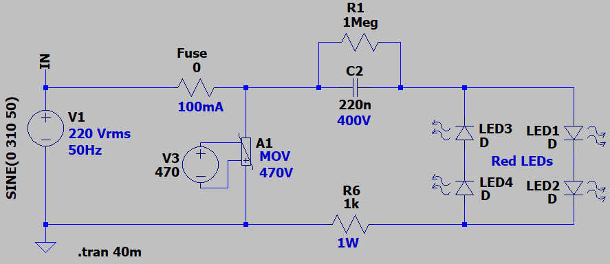
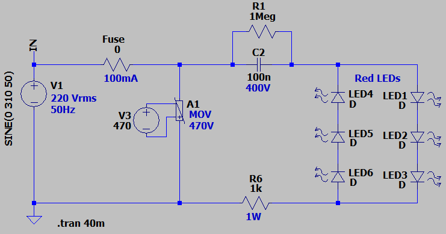
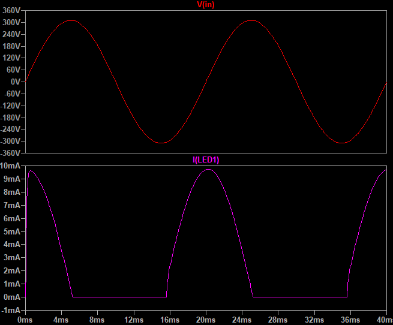
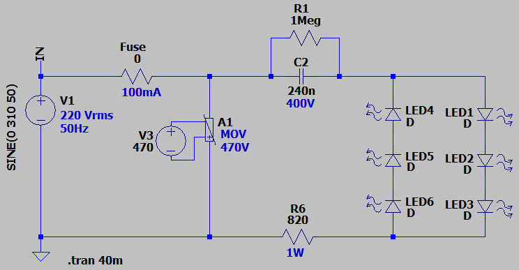
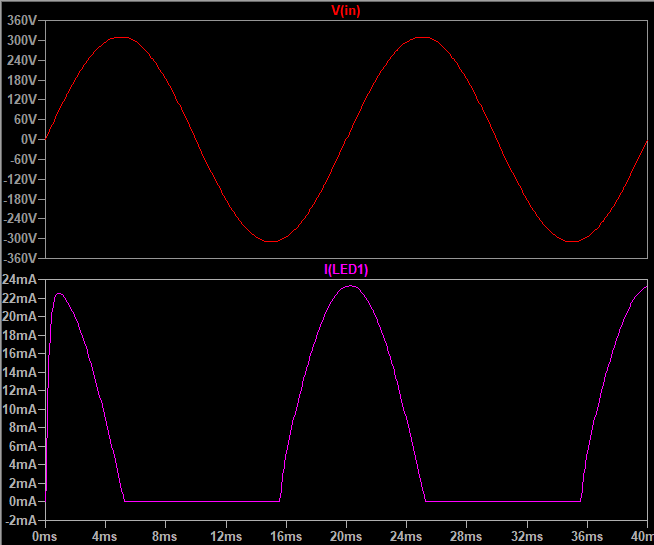

## Single-Phase Indicator Light 

### Simulate, Red LED x4
v1.0, Schematic  

v1.0, Plot  

### Simulate, Red LED x6
v1.0, Schematic  

v1.0, Plot  

### Simulate, Orang LED x6
v1.0, Schematic  

v1.0, Plot  

### More Information
**Note**: [You can go here to download a single folder or file from GitHub.com](https://minhaskamal.github.io/DownGit/#/home)  
My GitHub Account: [GitHub.com/AliRezaJoodi](https://github.com/AliRezaJoodi)  
