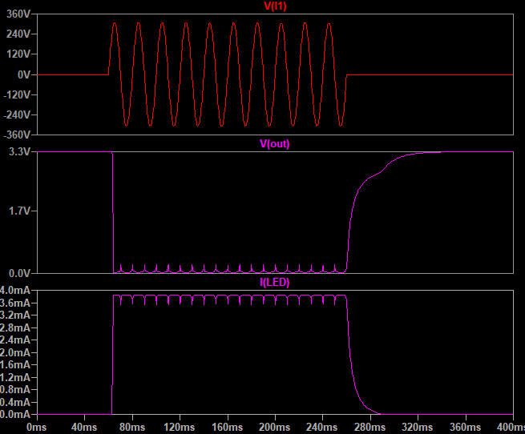

## Isolated Single Phase Detector Using Optocoupler

### Picture
v1.1  

### Features, v3.0
- **Isolation Type:** Opto
- **Isolation IC:** LTV814
- **Display Type:** LED
- **Power Supply:** 3.3V
- **Active Level:** Low

### Simulate
v3.0, Schematic  

v3.0, Plot  

### More Information
**Note**: [You can go here to download a single folder or file from GitHub.com](https://minhaskamal.github.io/DownGit/#/home)  
My GitHub Account: [GitHub.com/AliRezaJoodi](https://github.com/AliRezaJoodi)  
