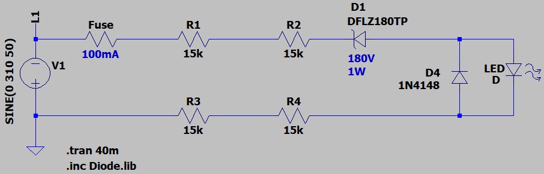
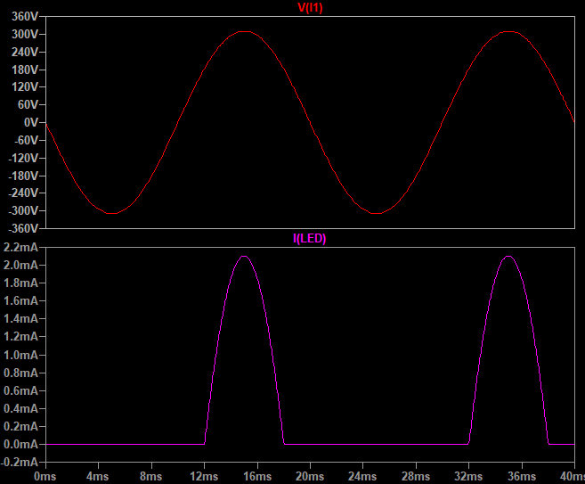

## Single-Phase Status LED
Note: Active for peak voltage above 180V.  
Note: Dust on high-voltage components is dangerous. Hot-melt glue can be used to insulate the high-voltage side safely.  

### Picture
v1.0  

### Simulate
v1.1, Schematic  

v1.1, Plot  

### More Information
**Note**: [You can go here to download a single folder or file from GitHub.com](https://minhaskamal.github.io/DownGit/#/home)  
My GitHub Account: [GitHub.com/AliRezaJoodi](https://github.com/AliRezaJoodi)  
