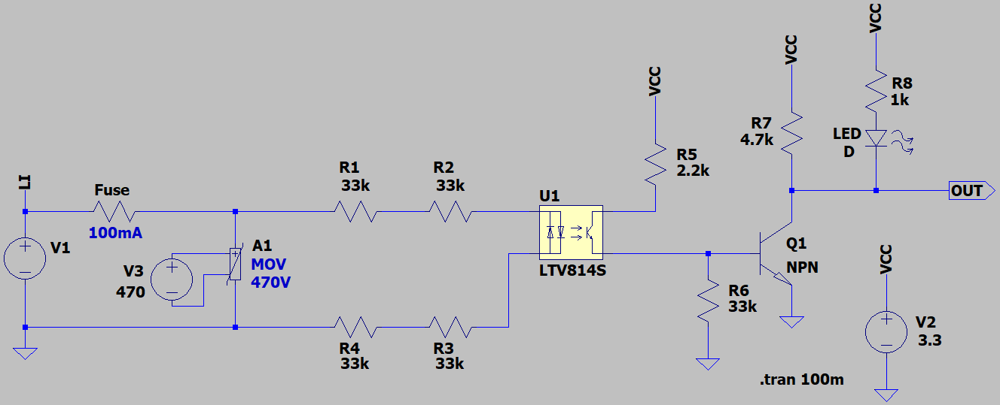
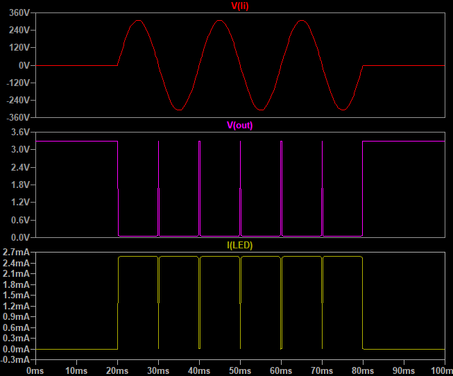

## Zero Crossing Detector for Single Phase

### Picture
v2.0  

### Simulate
v3.1, Schematic  

v3.1, Plot  

### More Information
**Note**: [You can go here to download a single folder or file from GitHub.com](https://minhaskamal.github.io/DownGit/#/home)  
My GitHub Account: [GitHub.com/AliRezaJoodi](https://github.com/AliRezaJoodi)  
