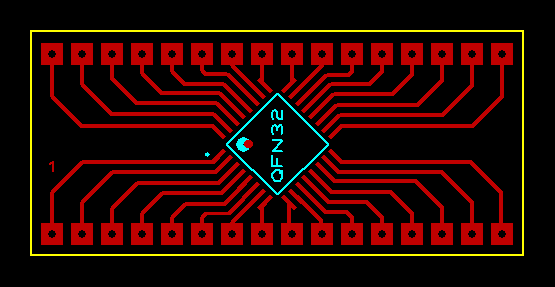

## SMD to DIP Converter

### Folders and Files Description
It has included:
- Pictures (Included photos samples made)

### QFN32 Package PCB: v1.0

My GitHub: [GitHub.com/AliRezaJoodi](https://github.com/AliRezaJoodi)  
**Note**: [You can go here to download a single folder or file from GitHub.com](https://minhaskamal.github.io/DownGit/#/home)