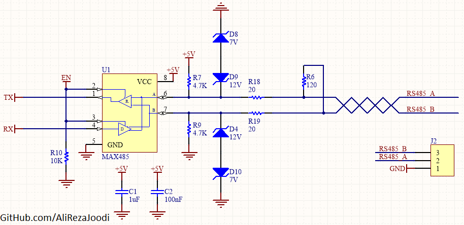

## TTL UART to RS485 Converter Using MAX485
 
I have tested it many times and worked great.

### Folders and Files Description
It has included:
- Hardware (Included hardware layers)
- Pictures (Included photos samples made)

### Schematic: V3.0

### Picture: V3.0

My GitHub: [GitHub.com/AliRezaJoodi](https://github.com/AliRezaJoodi)  
**Note**: [You can go here to download a single folder or file from GitHub.com](https://minhaskamal.github.io/DownGit/#/home)