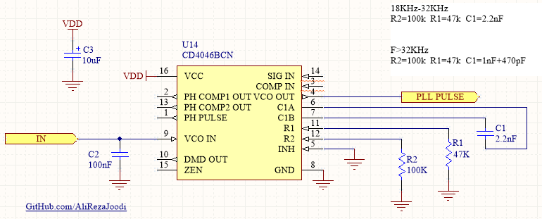

## Voltage-Controlled Oscillator (VCO) Using 4046
I tested it for many times and worked great.

It has included:
- Hardware (Included hardware layers)

### Schematic: v1.0

My GitHub: [GitHub.com/AliRezaJoodi](https://github.com/AliRezaJoodi)  
**Note**: [You can go here to download a single folder or file from GitHub.com](https://minhaskamal.github.io/DownGit/#/home)
