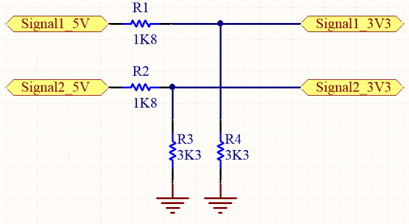
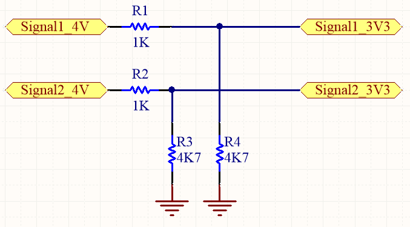

## Voltage Level Converter

It has included:
- Hardware (Included hardware layers)
- Simulate (Included simulator file)

### Solution 1
#### Voltage Divider with Resistor, Bi-Directional, 5V to 3V3  

Schematic: v1.0

#### Voltage Divider with Resistor, Bi-Directional, 4V to 3V3 
Schematic: v1.0

My GitHub: [GitHub.com/AliRezaJoodi](https://github.com/AliRezaJoodi)  
**Note**: [You can go here to download a single folder or file from GitHub.com](https://minhaskamal.github.io/DownGit/#/home)
