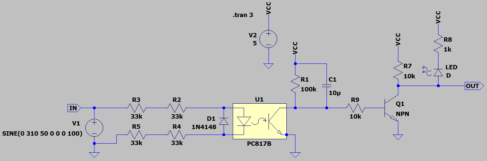
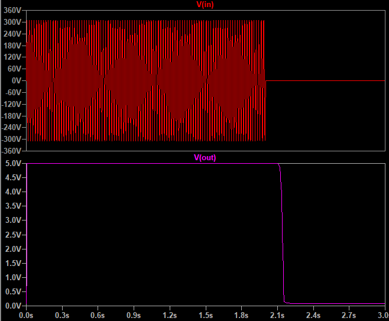

## Isolated Single Phase Detector

### Picture
v1.1  

### Simulate
v1.4, Schematic  

v1.4, Plot  

Note: Delay by 150mS

### Research
- Use of a LTV814S 

### More Information
**Note**: [You can go here to download a single folder or file from GitHub.com](https://minhaskamal.github.io/DownGit/#/home)  
My GitHub Account: [GitHub.com/AliRezaJoodi](https://github.com/AliRezaJoodi)  
