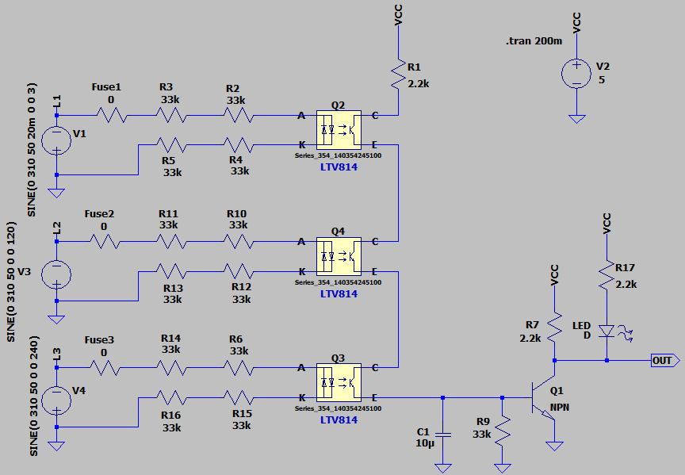
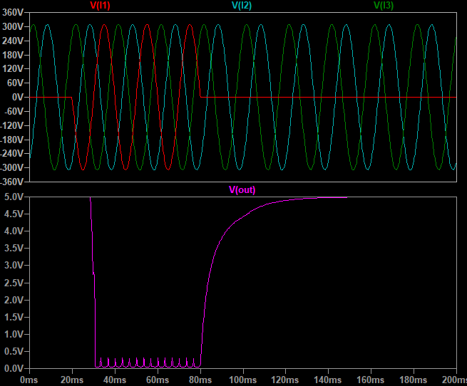

## Isolated 3-Phase Detector

### Features, v2.0
- **Isolation Type:** Opto
- **Isolation IC:** LTV814 x3
- **Display:** LED
- **Output Rule:** Output is AND with all three phases
- **Active Level:** Low

### Simulate
v2.1, Schematic  

v2.1, Plot  

### More Information
**Note**: [You can go here to download a single folder or file from GitHub.com](https://minhaskamal.github.io/DownGit/#/home)  
My GitHub Account: [GitHub.com/AliRezaJoodi](https://github.com/AliRezaJoodi)  
