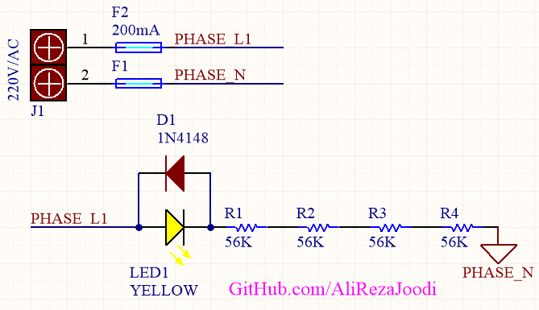

## A LED For Phase Detection

I tested it and worked great.

Note: Dust on the high voltage component is dangerous.Hot melt glue is useful to be safe high voltage side.  

### Folders and Files Description
It has included:
- Hardware (Included hardware layers)
- Pictures (Included photos samples made)

### Picture: v1.0

### Schematic: v1.0

My GitHub: [GitHub.com/AliRezaJoodi](https://github.com/AliRezaJoodi)  
**Note**: [You can go here to download a single folder or file from GitHub.com](https://minhaskamal.github.io/DownGit/#/home)
