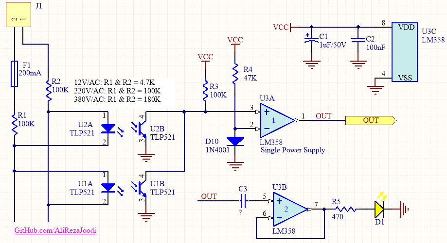
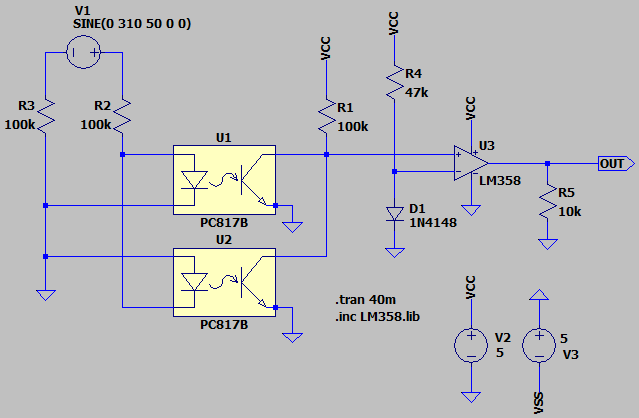
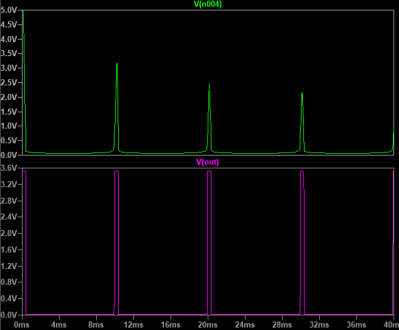
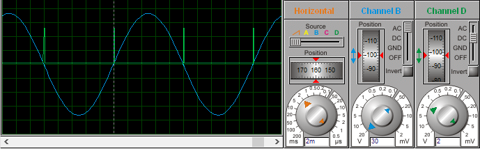

## Zero Crossing Detector for 1-Phase Dimmer

### Picture
v2.0  

### Schematic
v2.0  

### Simulate
v2.1, Schematic  

v2.1, Plot  

v2.0  

My GitHub: [GitHub.com/AliRezaJoodi](https://github.com/AliRezaJoodi)   
**Note**: [You can go here to download a single folder or file from GitHub.com](https://minhaskamal.github.io/DownGit/#/home)
