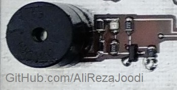
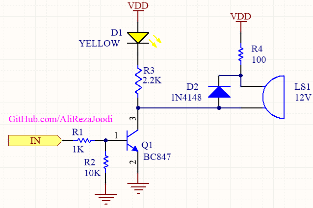

## Buzzer Driver
I tested it for many times and worked great.

### Folders and Files Description
It has included:
- Hardware (Included hardware layers.)
- Pictures (Included photos samples made)

### Picture: v1.0

### Picture: v1.3

### Schematic: v1.3

My GitHub: [GitHub.com/AliRezaJoodi](https://github.com/AliRezaJoodi)   
**Note**: [You can go here to download a single folder or file from GitHub.com](https://minhaskamal.github.io/DownGit/#/home)