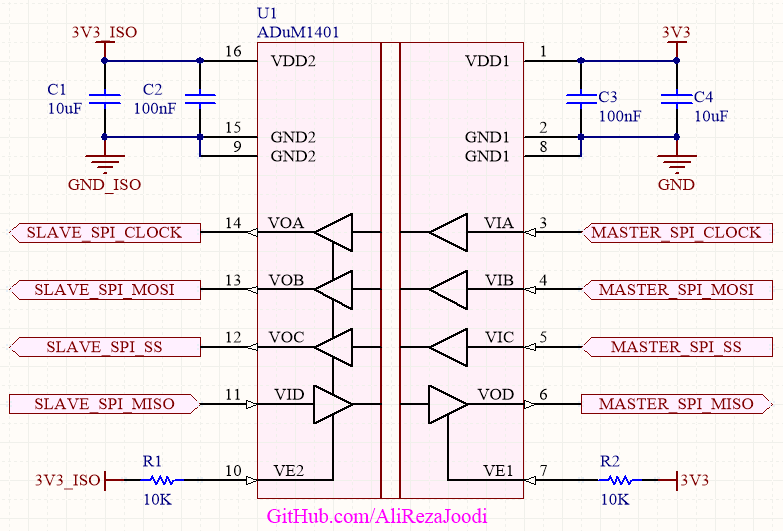

## Isolated SPI Interfacing With ADuM1401

It's usable for MAX11198 ADC.  
The ADC Features:  
- Input Voltage Range is ±VREF
- Absolute Input Voltage Range is AGND to AVDD

### Folders and Files Description
It has included:
- Hardware (Included hardware layers)
- Pictures (Included photos samples made)

### Picture: v1.0

### Schematic: v1.0

My GitHub: [GitHub.com/AliRezaJoodi](https://github.com/AliRezaJoodi)  
**Note**: [You can go here to download a single folder or file from GitHub.com](https://minhaskamal.github.io/DownGit/#/home)
