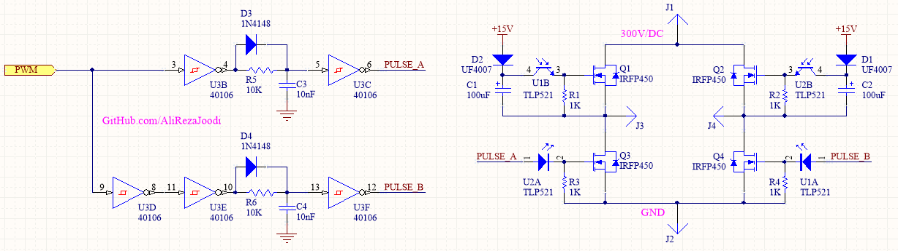

## High Power Full-Bridge Inverter with MOSFET Switches  
I used it for a UPS and worked great.

### Folders and Files Description
It has included:
- Hardware (Included hardware layers)

### Schematic: v1.0

My GitHub: [GitHub.com/AliRezaJoodi](https://github.com/AliRezaJoodi)  
**Note**: [You can go here to download a single folder or file from GitHub.com](https://minhaskamal.github.io/DownGit/#/home)