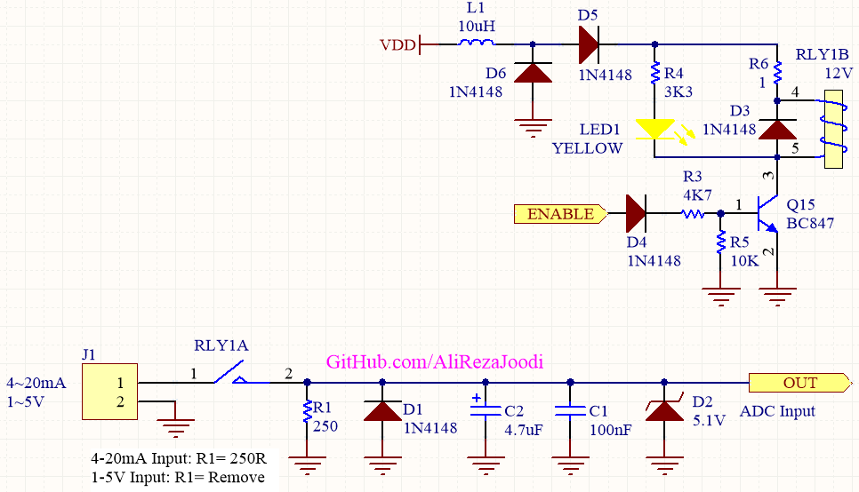

## ADC Input For 4-20mA and 1-5V
If we turn off a board power supply while a ADC input connect to 4~20mA external source, The microcontroller does not turn off completely.  
So, after turn on the board power supply, the micro will behave unreliably.  
It was my experience about control board that use a ATmega2560 for induction furnace. I had to use a switch before ADC for disconnect the external source.  
I tested it for many times and worked great.  

### Folders and Files Description
It has included:
- `Hardware` (Included hardware layers)
- `Pictures` (Included photos samples made)

### Picture: v1.0

### Schematic: v1.1

My GitHub: [GitHub.com/AliRezaJoodi](https://github.com/AliRezaJoodi)  
**Note**: [You can go here to download a single folder or file from GitHub.com](https://minhaskamal.github.io/DownGit/#/home)
