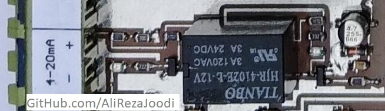

It's about **Analog Input to Microcontroller**. I tested it for many times and worked great.

It has included:
- Hardware (Included hardware layers.)
- Pictures (Included photos samples made.)

### Schematic: V2.0

### Picture: V2.0

### Schematic: V1.0

### Picture: V1.0

**Note**: [You can go here to download a single folder or file from GitHub.com](https://minhaskamal.github.io/DownGit/#/home)
