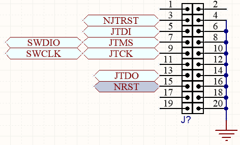
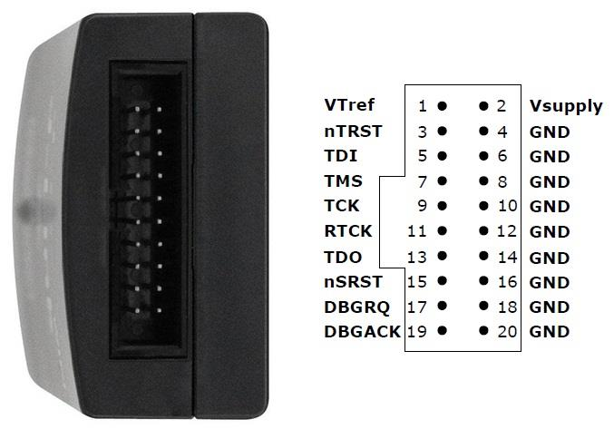

## SWJ Connector for STM32 Programering 

It has included:
- Hardware (Included hardware layers.)
- Pictures (Included photos samples made)

### Schematic: v1.0

### Picture: STM32 development board, STM32 Smart V2.0

### Picture: JLink Programmer, Pinout

My GitHub: [GitHub.com/AliRezaJoodi](https://github.com/AliRezaJoodi)  
**Note**: [You can go here to download a single folder or file from GitHub.com](https://minhaskamal.github.io/DownGit/#/home)
