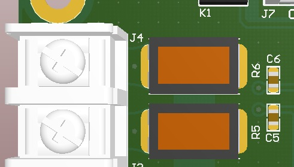
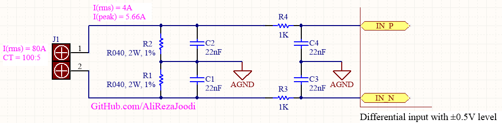

## AC Current Measurement Using Current Transformer for Differential Analog Input

Note: These voltage input pairs have a maximum differential signal of ±0.5V. In addition, the maximum signal level on analog inputs is ±0.5V with respect to AGND.

Note: It's usable for ADE7858 IC. ADE7858 is a energy metering IC. 

### Folders and Files Description
It has included:
- Hardware (Included hardware layers)
- Pictures (Included photos samples made)

### Picture: v1.0

### Schematic: v1.0

My GitHub: [GitHub.com/AliRezaJoodi](https://github.com/AliRezaJoodi)  
**Note**: [You can go here to download a single folder or file from GitHub.com](https://minhaskamal.github.io/DownGit/#/home)
