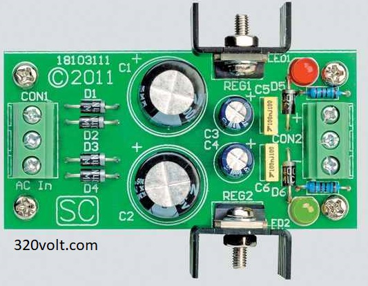

It's about **DC Dual Power Supply**.
I tested it for many times and worked great.

It has included:
- Hardware (Included hardware layers)
- Pictures (Included photos samples made)
- Simulate (Included simulator file)

### Schematic: V1.0

### Picture: V1.0

**Note**: [You can go here to download a single folder or file from GitHub.com](https://minhaskamal.github.io/DownGit/#/home)