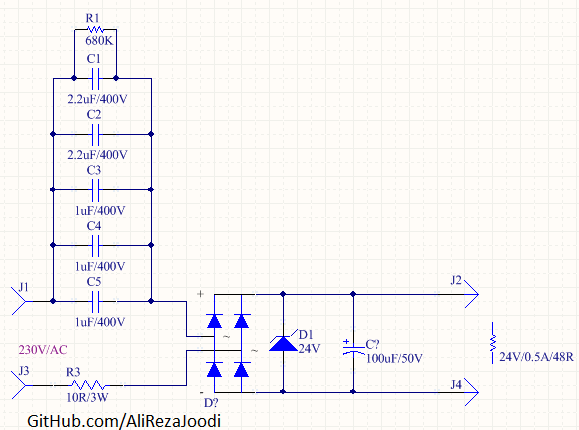

## A Capacitive Power Supply
I tested it and worked great.

Note: $Xc={{1\over 2πfC}}$ (`f` is frequency and `C` is the capacitance)

### Folders and Files Description
It has included:
- Hardware (Included hardware layers)
- Pictures (Included photos samples made)

### Schematic: V2.0

### Picture: V2.0

My GitHub Account: [GitHub.com/AliRezaJoodi](https://github.com/AliRezaJoodi)  
**Note**: [You can go here to download a single folder or file from GitHub.com](https://minhaskamal.github.io/DownGit/#/home)
