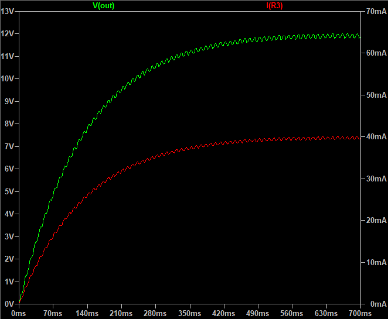

## Capacitive Power Supply
Note: $Xc={{1\over 2πfC}}$ (`f` is frequency and `C` is the capacitance)  

### Folders
- `Hardware` — Schematic files
- `Pictures` — Project photos
- `Simulate` — Simulation files

### 12V/40mA Load
v1.0, Schematic  

v1.0, Plot  

### 24V/500mA Load
v1.0, photo  

v1.0, Schematic  

### Source
[Capacitor Impedance Calculator](https://www.allaboutcircuits.com/tools/capacitor-impedance-calculator/)
[Transformerless power supply calculator](http://www.nomad.ee/micros/transformerless/index.shtml)

### More Information
**Note**: [You can go here to download a single folder or file from GitHub.com](https://minhaskamal.github.io/DownGit/#/home)  
My GitHub Account: [GitHub.com/AliRezaJoodi](https://github.com/AliRezaJoodi)  
