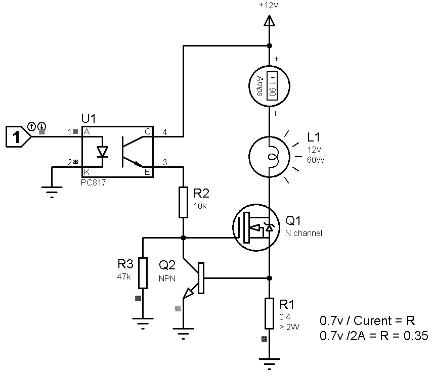
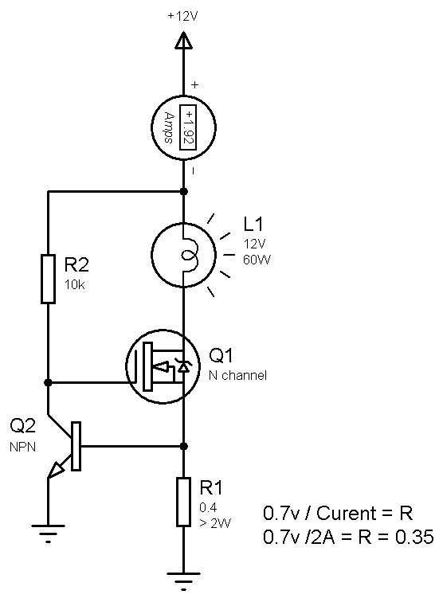

## Current Limiter With MOSFET
Note: The MOSFET was very high temp
Note: Limited to 2A

### Folders and Files Description
It has included:
- `Simulate` — Simulating the project with Proteus

### Simulate
v2.0  

v1.0  

My GitHub: [GitHub.com/AliRezaJoodi](https://github.com/AliRezaJoodi)  
**Note**: [You can go here to download a single folder or file from GitHub.com](https://minhaskamal.github.io/DownGit/#/home)
