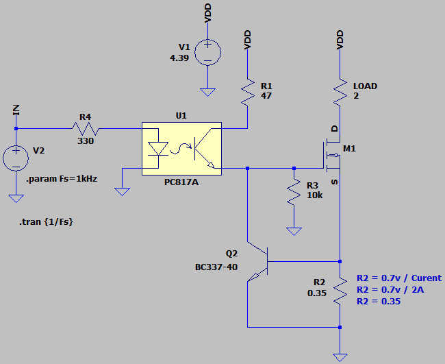
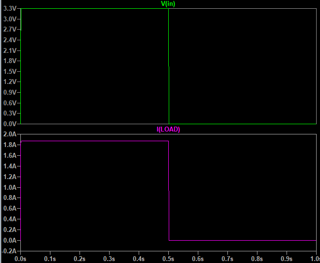

## Current Limiter Using MOSFET
Note: The MOSFET gets hot because it is working in the linear region.
Note: Limited to 2A

### Simulate
v2.0, Schematic  

v2.0, Plot  

### Upgrade
- The MOSFET should operate in the saturation region.

### More Information
**Note**: [You can go here to download a single folder or file from GitHub.com](https://minhaskamal.github.io/DownGit/#/home)  
My GitHub Account: [GitHub.com/AliRezaJoodi](https://github.com/AliRezaJoodi)  

