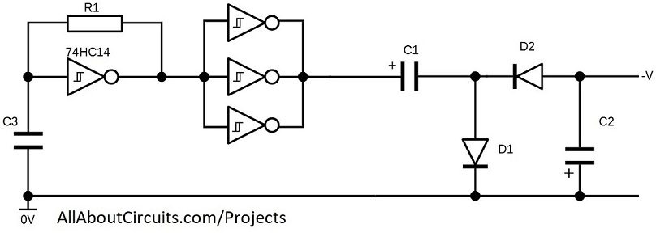

## Negative Voltage Generator Using 40106

### Folders and Files Description
It has included:
- Hardware (Included hardware layers)
- Simulate (Included simulator file)

### Schematic: v1.0

**Note**: [You can go here to download a single folder or file from GitHub.com](https://minhaskamal.github.io/DownGit/#/home)
