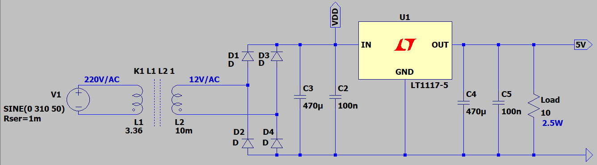
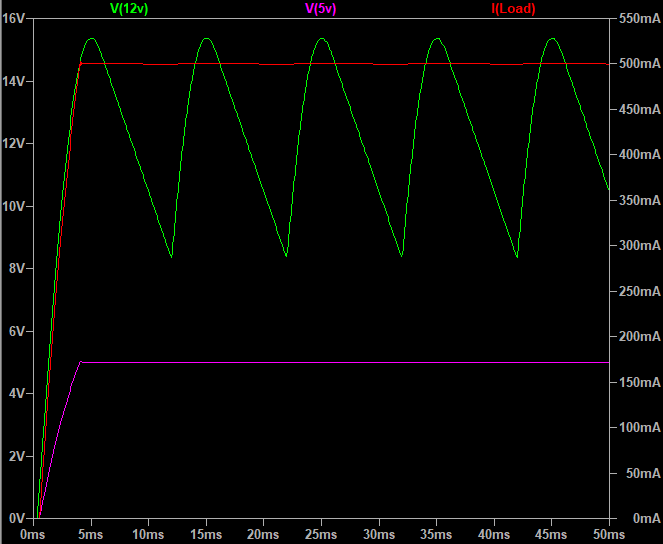
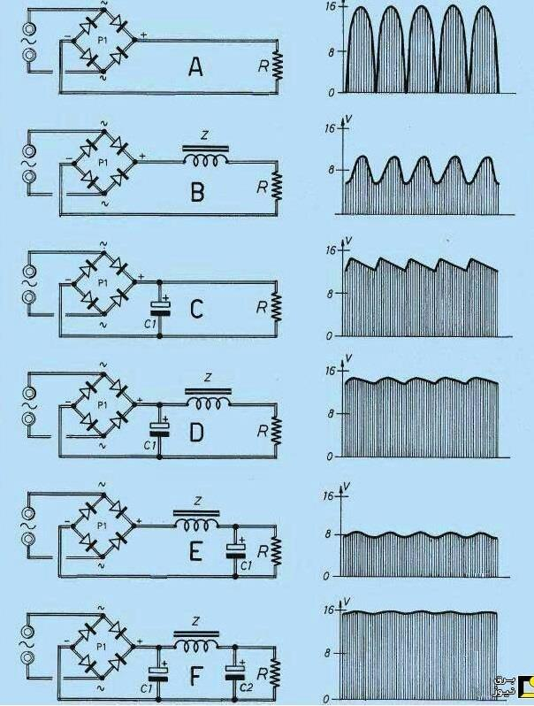

## Full Bridge Rectifier Using 2-Wire Transformer

### Picture: v1.0

### Folders
- `Pictures` — Project photos
- `Simulate` — Simulation file

### Simulate for 2.5W Load (5V, 500mA)
v2.0, Schematic  

v2.0, Plot  

### Guid

### More Information
**Note**: [You can go here to download a single folder or file from GitHub.com](https://minhaskamal.github.io/DownGit/#/home)  
My GitHub Account: [GitHub.com/AliRezaJoodi](https://github.com/AliRezaJoodi)  
