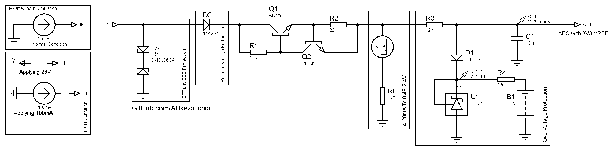

## Protect a 4~20mA Current Input

### Folders and Files Description
It has included:
- Simulate (Included simulator file)

### Simulate: v1.0

- Diode 1N4937 withstands 600V reverse voltage.
- Transistor NPN BD139 withstands 80V of VCE and VCB.
- TL431 is a voltage reference with around 2.5V with this configuration. 

About transistors role:
R1 biases Q1 such that it conducts. If the current through R2 is too large, Q2 is biased such that it also begins conducting, and thus begins to drain away some of the current going into the base of Q1, which starts to conducts less. In other words, this circuit limits the current going through it to approx 0.7V / 22ohm (Vbe(sat)_Q2 / R2) for the cost of the voltage drop across R2 + VCE_Q1

Source Link: [Jeferson Pehls](https://www.linkedin.com/feed/update/urn:li:activity:7042709425547001856/)

My GitHub: [GitHub.com/AliRezaJoodi](https://github.com/AliRezaJoodi)  
**Note**: [You can go here to download a single folder or file from GitHub.com](https://minhaskamal.github.io/DownGit/#/home)
