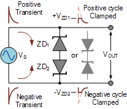
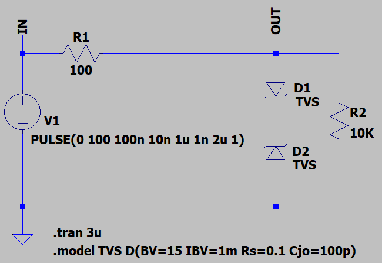
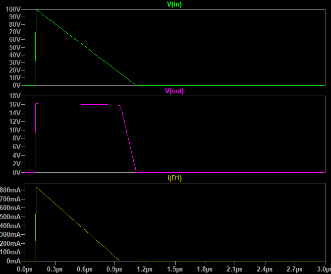

## IGBT Gate Protective
  

### Folders
- `Hardware` — Included hardware layers
- `Pictures` — Included photos

### Picture
v1.0  

### Schematic
v1.0  

### Simulate
v1.0, Schematic  

v1.0, Plot  

### More Information
**Note**: [You can go here to download a single folder or file from GitHub.com](https://minhaskamal.github.io/DownGit/#/home)  
My GitHub Account: [GitHub.com/AliRezaJoodi](https://github.com/AliRezaJoodi)  
