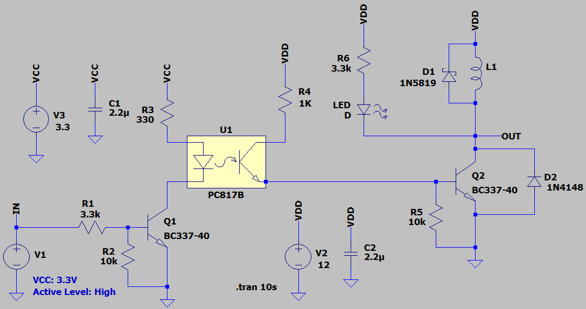

## Isolated Relay Driver Using Optocoupler

### Features, v2.1
- **Isolation Type:** Opto
- **Isolation IC:** PC817
- **Display Type:** LED
- **Power Supply:** 12V, 3.3V
- **Active Level:** High

### Simulate
v2.1, Schematic  

v2.1, Plot  

### More Information
**Note**: [You can go here to download a single folder or file from GitHub.com](https://minhaskamal.github.io/DownGit/#/home)  
My GitHub Account: [GitHub.com/AliRezaJoodi](https://github.com/AliRezaJoodi)  