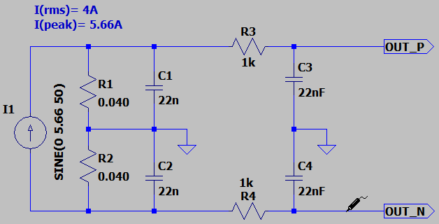
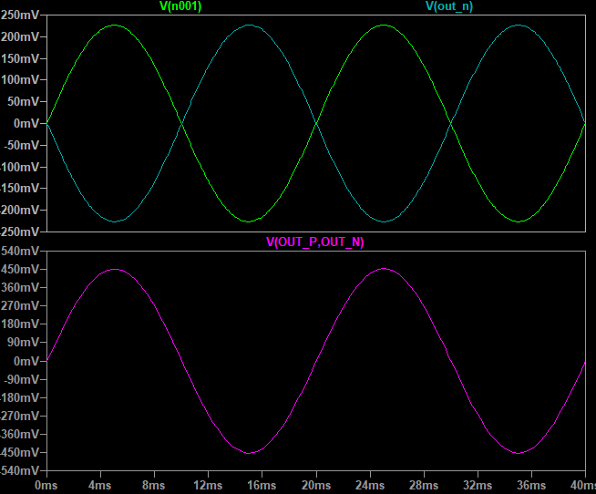

## AC Current Measurement with Current Transformer (CT) Using Differential Bipolar Analog Input

It's usable for ADE7858 IC. ADE7858 is a energy metering IC.  
These voltage input pairs have a maximum differential signal of ±0.5V. In addition, the maximum signal level on analog inputs is ±0.5V with respect to AGND.

### Picture
v1.0  

### Schematic
v1.0  

### Simulate
v1.0, Schematic  

v1.0, Plot  

### More Information
**Note**: [You can go here to download a single folder or file from GitHub.com](https://minhaskamal.github.io/DownGit/#/home)  
My GitHub Account: [GitHub.com/AliRezaJoodi](https://github.com/AliRezaJoodi)  
