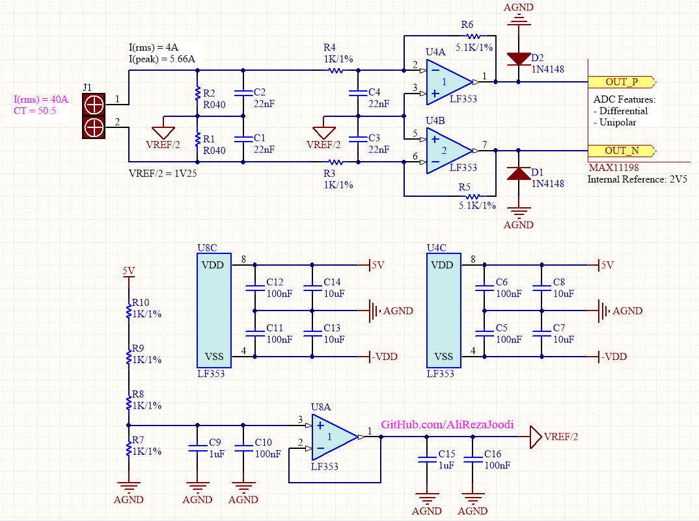
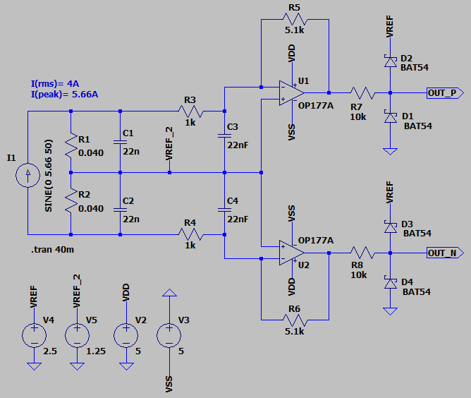

## AC Current Measurement with Current Transformer (CT) Using Differential and Unipolar Analog Input

It's usable for MAX11198 ADC.  
The ADC Features:
- Internal Reference is 2.5V  
- Input Voltage Range is ±VREF
- Absolute Input Voltage Range is AGND to AVDD

### Picture
v1.0  

### Schematic
v1.0  

### Simulate
v1.0, Schematic  

v1.0, Plot  

### More Information
**Note**: [You can go here to download a single folder or file from GitHub.com](https://minhaskamal.github.io/DownGit/#/home)  
My GitHub Account: [GitHub.com/AliRezaJoodi](https://github.com/AliRezaJoodi)  
