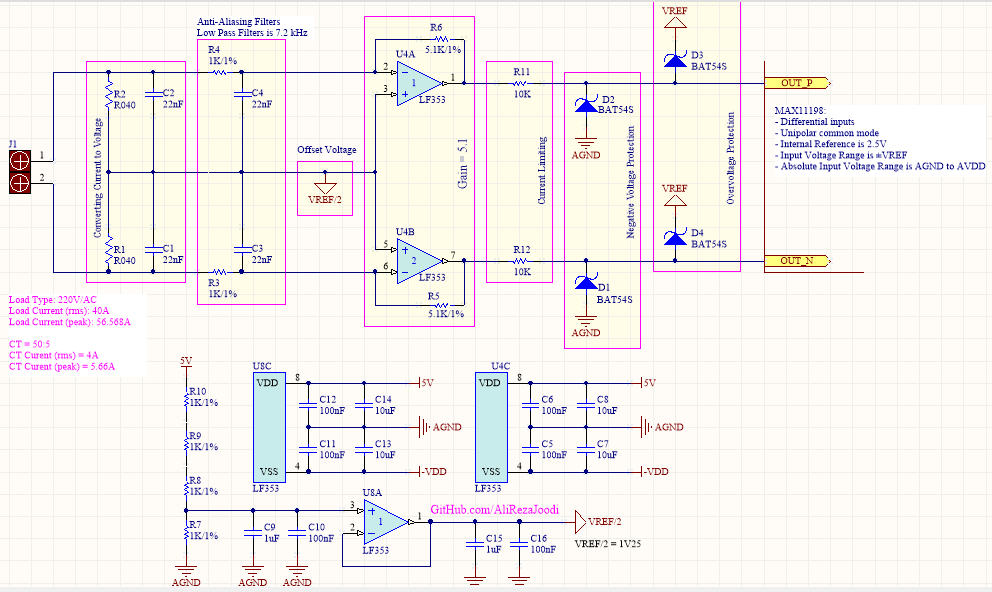
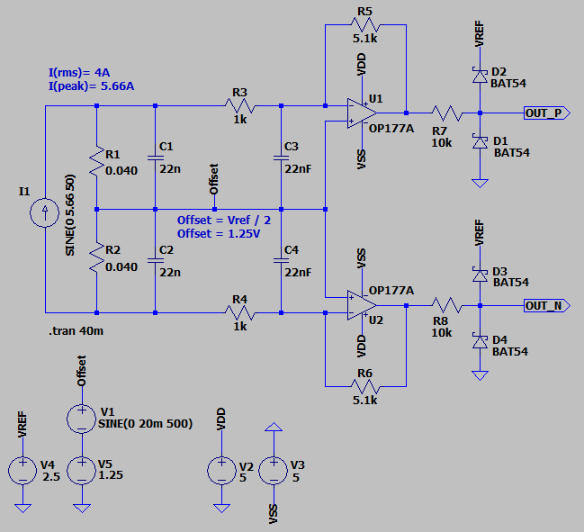
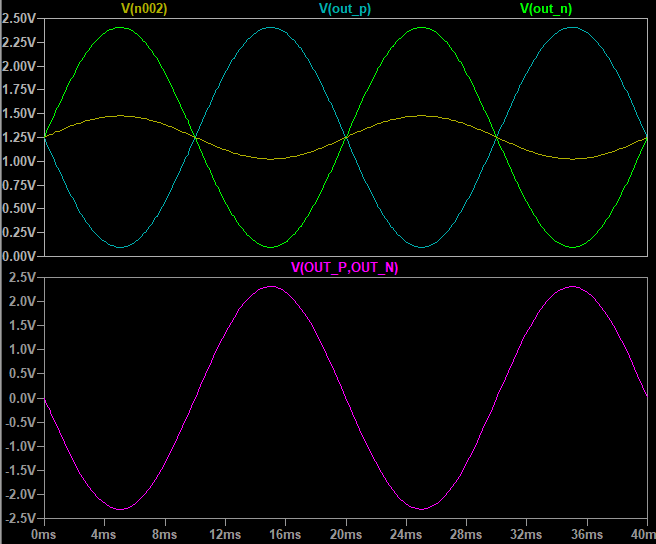

## AC Current Measurement with CT Using Differential and Unipolar Analog Input
Designed for MAX11198 ADC.    
The ADC Features:
- Differential inputs
- Unipolar common mode
- Internal Reference is 2.5V  
- Input Voltage Range is ±VREF
- Absolute Input Voltage Range is AGND to AVDD

### Picture
v1.0  

### Schematic
v1.1  

### Simulate
v1.1, Schematic  

v1.1, Plot  

### Upgrade
- Use a low-offset op-amp instead.
- Generate offset using a voltage reference IC.

### More Information
**Note**: [You can go here to download a single folder or file from GitHub.com](https://minhaskamal.github.io/DownGit/#/home)  
My GitHub Account: [GitHub.com/AliRezaJoodi](https://github.com/AliRezaJoodi)  
