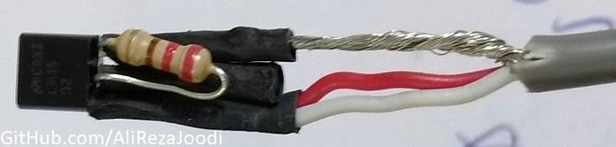
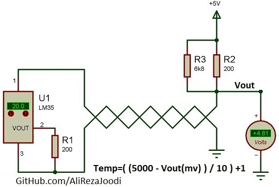
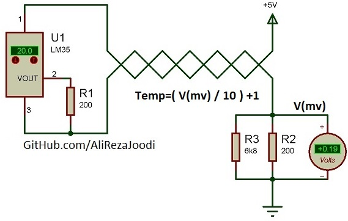

## Two-Wire Temperature Sensor With LM35
I tested it and worked great.

### Folders and Files Description
It has included:
- Hardware (Included schematic with jpg format)
- Pictures (Included photos samples made)
- Simulate (Included simulator file)

### Picture: v2.0

### Schematic: v2.0

### Schematic: v1.0

Source: LM35 Datasheet (National Semiconductor), Figure 5

My GitHub: [GitHub.com/AliRezaJoodi](https://github.com/AliRezaJoodi)  
**Note**: [You can go here to download a single folder or file from GitHub.com](https://minhaskamal.github.io/DownGit/#/home)
