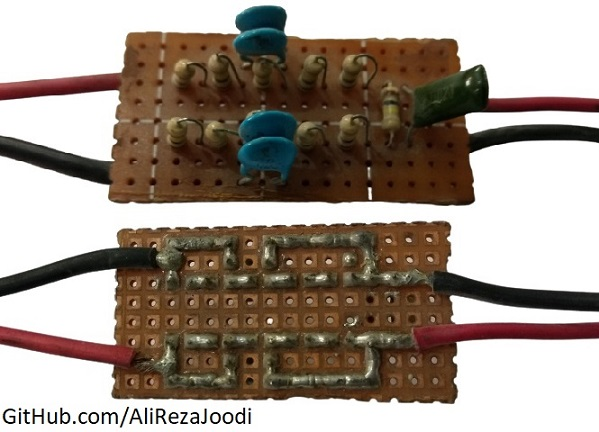

## High Voltage Divider for Use Scope Prop
I tested it for 500V and worked great.

### Folders and Files Description
It has included:
- Pictures (Included photos samples made)

### Picture: v1.0

My GitHub: [GitHub.com/AliRezaJoodi](https://github.com/AliRezaJoodi)  
**Note**: [You can go here to download a single folder or file from GitHub.com](https://minhaskamal.github.io/DownGit/#/home)